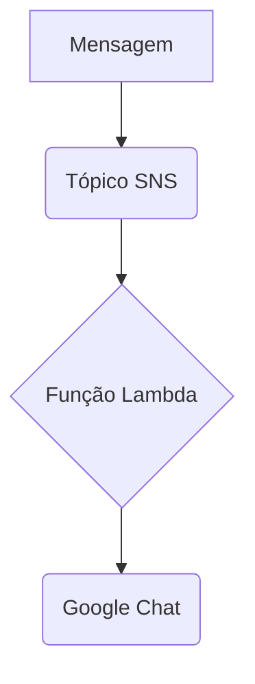

# Terraform AWS SNS to Google Chat

Este projeto Terraform implanta uma infraestrutura na AWS que encaminha mensagens de um tópico SNS (Simple Notification Service) para um espaço do Google Chat usando uma função Lambda. É uma solução "serverless" e econômica para receber notificações e alertas da AWS diretamente no seu ambiente de colaboração.

## Features

- **Infraestrutura como Código (IaC):** Toda a infraestrutura é definida e gerenciada usando Terraform, permitindo implantação e replicação consistentes.
- **Serverless:** Utiliza AWS Lambda, eliminando a necessidade de gerenciar servidores.
- **Integração com Google Chat:** Receba notificações da AWS em tempo real no seu espaço do Google Chat.
- **Altamente Configurável:** Use variáveis do Terraform para personalizar o nome do alerta e a URL do webhook do Google Chat.
- **Formatação de Mensagens:** A função Lambda formata as mensagens do SNS de forma clara e legível para o Google Chat, incluindo informações como assunto, mensagem e timestamp.

## Como Funciona

O fluxo de trabalho é o seguinte:

1.  Uma mensagem é publicada em um tópico SNS da AWS.
2.  O tópico SNS aciona uma função Lambda.
3.  A função Lambda processa a mensagem do SNS.
4.  A função Lambda formata a mensagem e a envia para a URL do webhook do Google Chat configurada.
5.  A mensagem aparece no espaço do Google Chat.



## Pré-requisitos

Antes de começar, você precisará ter o seguinte:

-   [Terraform](https://learn.hashicorp.com/tutorials/terraform/install-cli) instalado.
-   [Credenciais da AWS](https://docs.aws.amazon.com/keyspaces/latest/devguide/setting-up-aws-credentials.html) configuradas em seu ambiente.
-   Uma [URL de webhook do Google Chat](https://developers.google.com/chat/how-tos/webhooks).

## Como Usar

1.  **Clone o repositório:**

    ```bash
    git clone https://github.com/seu-usuario/terraform-aws-sns-to-googlechat.git
    cd terraform-aws-sns-to-googlechat
    ```

2.  **Crie um arquivo `terraform.tfvars`:**

    Crie um arquivo chamado `terraform.tfvars` e adicione as seguintes variáveis:

    ```hcl
    gchat_webhook_url = "URL_DO_SEU_WEBHOOK_DO_GOOGLE_CHAT"
    alert_name        = "meu-alerta-personalizado"
    ```

3.  **Inicialize o Terraform:**

    ```bash
    terraform init
    ```

4.  **Aplique o plano do Terraform:**

    ```bash
    terraform apply
    ```

    O Terraform provisionará os recursos necessários na sua conta da AWS.

5.  **Teste a integração:**

    Você pode testar a integração publicando uma mensagem no tópico SNS criado. Você pode fazer isso através do Console da AWS ou usando a AWS CLI:

    ```bash
    aws sns publish --topic-arn "ARN_DO_SEU_TOPICO_SNS" --message "Olá, mundo!"
    ```

    Você deverá receber uma notificação no seu espaço do Google Chat.

## Variáveis do Terraform

| Nome                | Descrição                                    | Tipo   | Padrão              | Obrigatório |
| ------------------- | ---------------------------------------------- | ------ | ------------------- | ----------- |
| `gchat_webhook_url` | URL do webhook do Google Chat para enviar alertas. | `string` | `""`                | Sim         |
| `alert_name`        | Nome do alerta, usado para nomear os recursos.   | `string` | `"purpose-X-alert"` | Não         |

## Função Lambda

A função Lambda é escrita em Python 3.9 e usa a biblioteca `requests` para enviar mensagens para o Google Chat. O código da função está embutido no arquivo `lambda.tf` e é empacotado em um arquivo `.zip` durante a implantação.

A função é projetada para processar eventos do SNS e formatar a mensagem de uma maneira amigável para o Google Chat. Ela também inclui tratamento de erros e notifica o Google Chat em caso de falha no processamento.

## Licença

Este projeto está licenciado sob a Licença MIT. Veja o arquivo [LICENSE](LICENSE) para mais detalhes.
