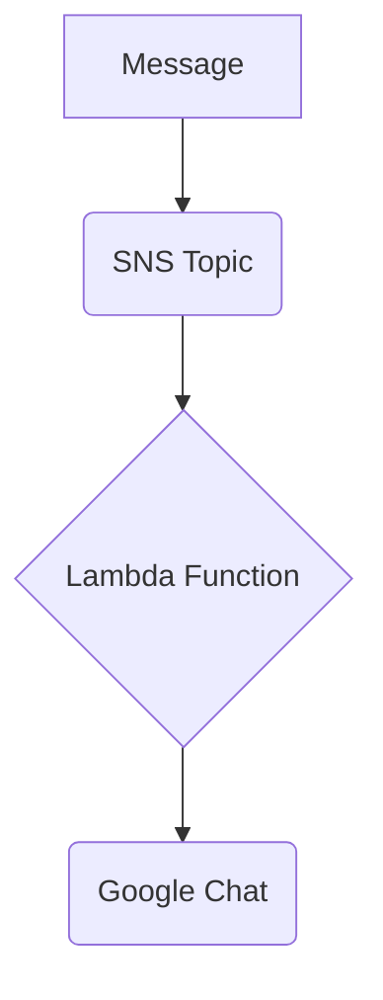

# Terraform AWS SNS to Google Chat

This Terraform project deploys an infrastructure on AWS that forwards messages from an SNS (Simple Notification Service) topic to a Google Chat space using a Lambda function. It is a "serverless" and cost-effective solution for receiving notifications and alerts from AWS directly in your collaboration environment.

## Features

- **Infrastructure as Code (IaC):** The entire infrastructure is defined and managed using Terraform, allowing for consistent deployment and replication.
- **Serverless:** Uses AWS Lambda, eliminating the need to manage servers.
- **Google Chat Integration:** Receive AWS notifications in real-time in your Google Chat space.
- **Highly Configurable:** Use Terraform variables to customize the alert name and Google Chat webhook URL.
- **Message Formatting:** The Lambda function formats SNS messages clearly and legibly for Google Chat, including information such as subject, message, and timestamp.

## How It Works

The workflow is as follows:

1.  A message is published to an AWS SNS topic.
2.  The SNS topic triggers a Lambda function.
3.  The Lambda function processes the SNS message.
4.  The Lambda function formats the message and sends it to the configured Google Chat webhook URL.
5.  The message appears in the Google Chat space.



## Prerequisites

Before you begin, you will need to have the following:

-   [Terraform](https://learn.hashicorp.com/tutorials/terraform/install-cli) installed.
-   [AWS Credentials](https://docs.aws.amazon.com/keyspaces/latest/devguide/setting-up-aws-credentials.html) configured in your environment.
-   A [Google Chat webhook URL](https://developers.google.com/chat/how-tos/webhooks).

## How to Use

1.  **Clone the repository:**

    ```bash
    git clone https://github.com/your-user/terraform-aws-sns-to-googlechat.git
    cd terraform-aws-sns-to-googlechat
    ```

2.  **Create a `terraform.tfvars` file:**

    Create a file named `terraform.tfvars` and add the following variables:

    ```hcl
    gchat_webhook_url = "YOUR_GOOGLE_CHAT_WEBHOOK_URL"
    alert_name        = "my-custom-alert"
    ```

3.  **Initialize Terraform:**

    ```bash
    terraform init
    ```

4.  **Apply the Terraform plan:**

    ```bash
    terraform apply
    ```

    Terraform will provision the necessary resources in your AWS account.

5.  **Test the integration:**

    You can test the integration by publishing a message to the created SNS topic. You can do this through the AWS Console or by using the AWS CLI:

    ```bash
    aws sns publish --topic-arn "YOUR_SNS_TOPIC_ARN" --message "Hello, world!"
    ```

    You should receive a notification in your Google Chat space.

## Terraform Variables

| Name                | Description                                    | Type   | Default             | Required |
| ------------------- | ---------------------------------------------- | ------ | ------------------- | -------- |
| `gchat_webhook_url` | Google Chat webhook URL to send alerts to.       | `string` | `""`                | Yes      |
| `alert_name`        | Name of the alert, used to name the resources.   | `string` | `"purpose-X-alert"` | No       |

## Lambda Function

The Lambda function is written in Python 3.9 and uses the `requests` library to send messages to Google Chat. The function's code is embedded in the `lambda.tf` file and is packaged into a `.zip` file during deployment.

The function is designed to process SNS events and format the message in a user-friendly way for Google Chat. It also includes error handling and notifies Google Chat in case of processing failure.

## License

This project is licensed under the MIT License. See the [LICENSE](LICENSE) file for more details.